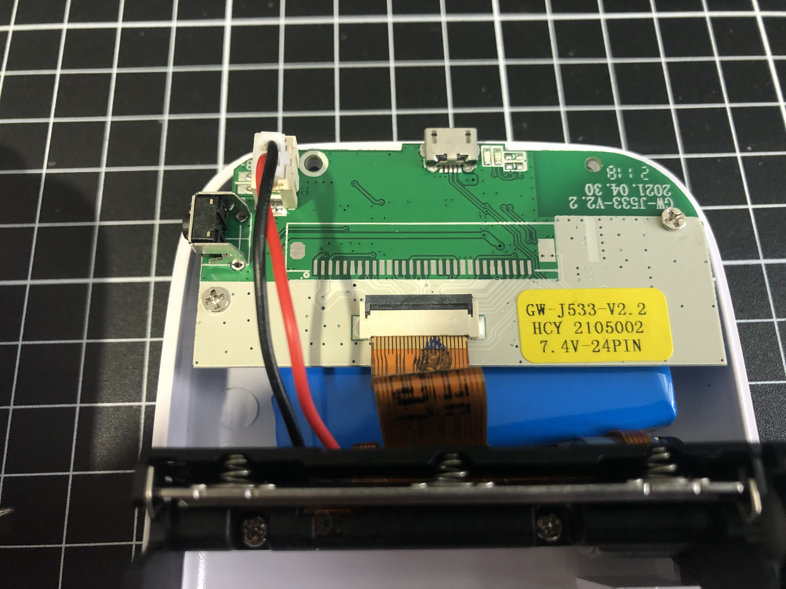
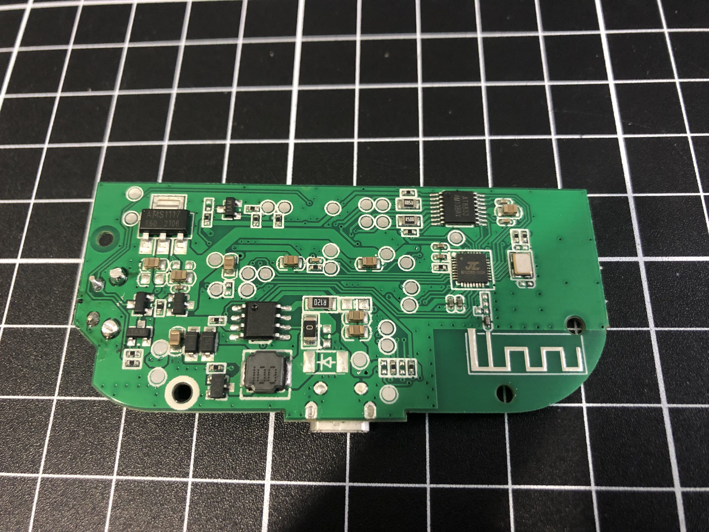
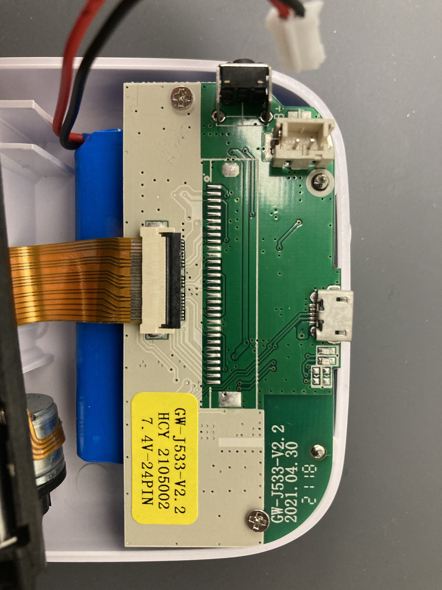
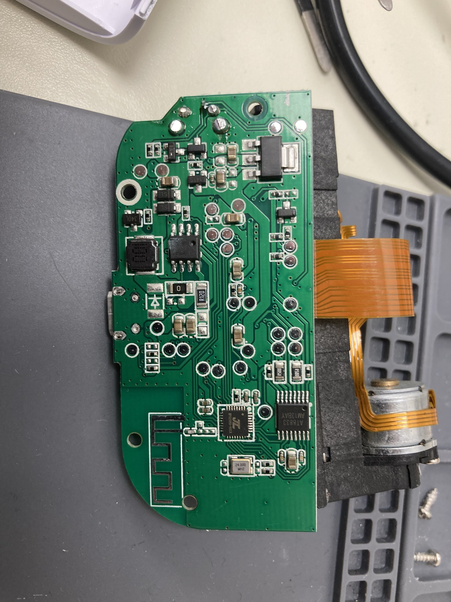
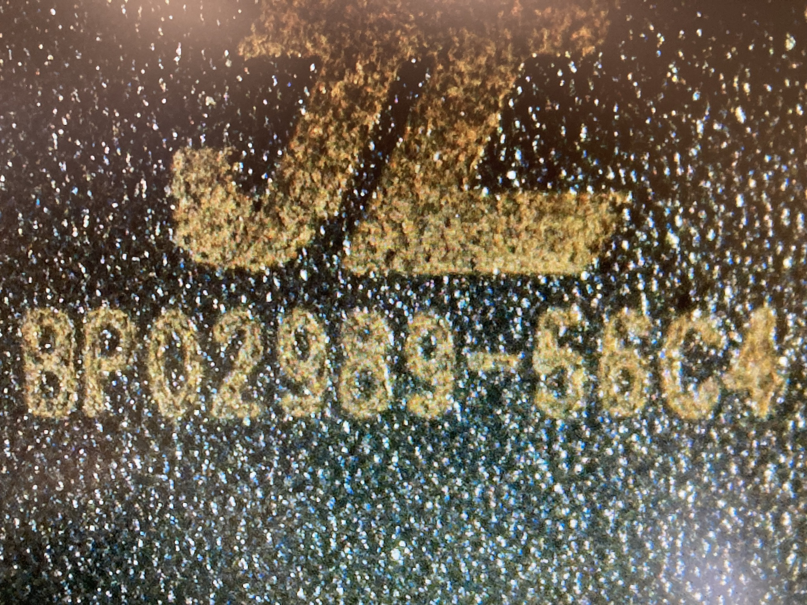
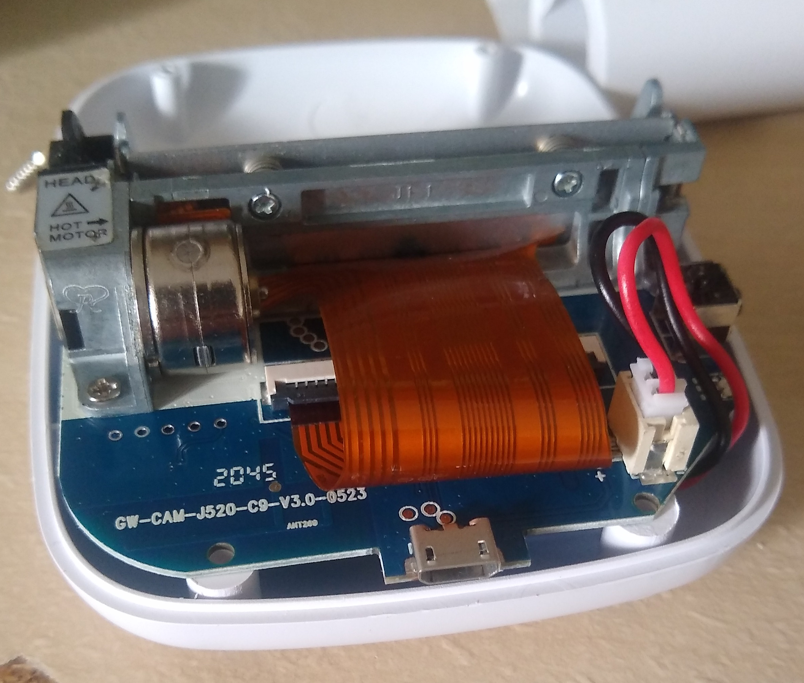
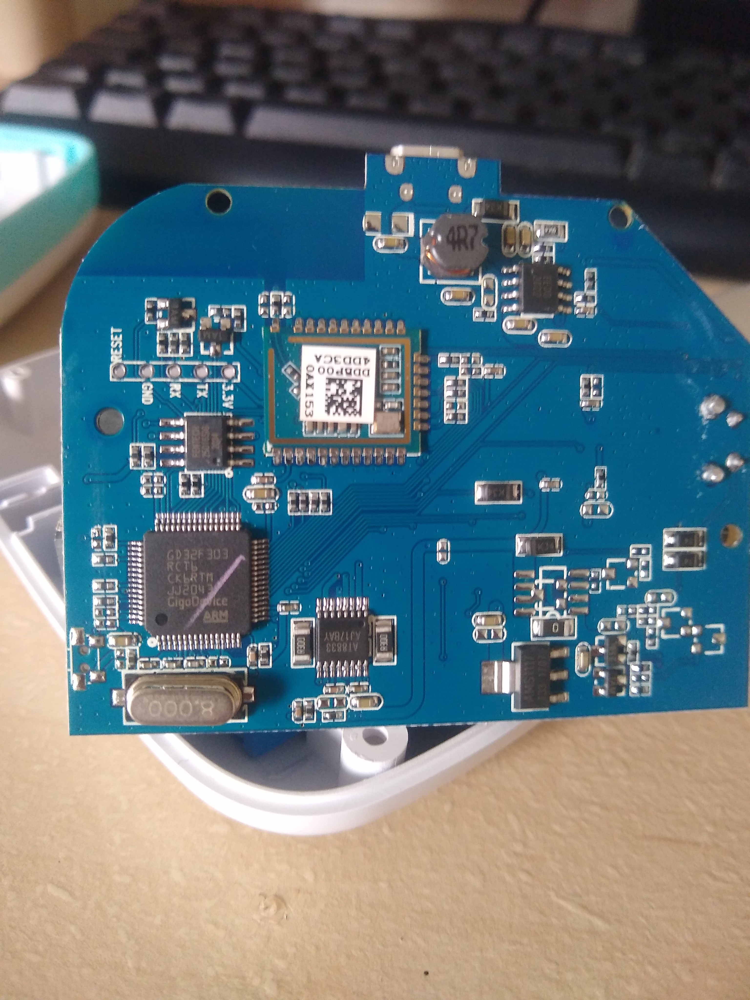
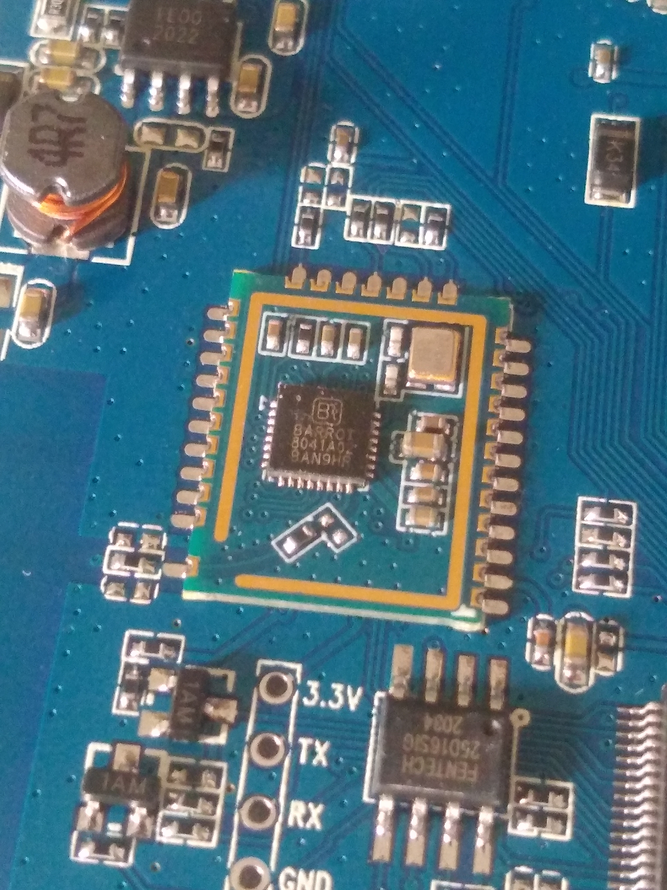

# Cat Printer
> "cat printer 🥺"

*A central repository to link to documentation and projects related to cat-shaped bluetooth thermal printers. PRs encouraged.*

## Protocol implementations

In chronological order:

| Name                                                                                        | Comments                                                                                            | Bluetooth Library | Platforms verified working |
|---------------------------------------------------------------------------------------------|-----------------------------------------------------------------------------------------------------|-------------------|----------------------------|
| com.blueUtils                                                                    | Official driver for cat printers, closed source Android module, used in apps [iPrint](https://play.google.com/store/apps/details?id=com.frogtosea.iprint), 精准学习, maybe others. Phones home a lot.      | [Android-BLE](https://github.com/aicareles/Android-BLE) (modified) | **Android**           |
| [WerWolv / PythonCatPrinter](https://github.com/WerWolv/PythonCatPrinter)                   | WerWolv's original implementation bassed on their [blog post](https://werwolv.net/blog/cat_printer) | Bleak (Python)    |                            |
| [amber-sixel / gb01print](https://github.com/amber-sixel/gb01print)           | AmberSixel's fork of WerWolv's implementation.                                                      | Bleak (Python)    |  **Windows**, **Linux**         | 
| [the6p4c / catteprinter](https://github.com/the6p4c/catteprinter)                           | the6p4c's Rust library                                                                              | btleplug (Rust)   | **Windows**<sup>1</sup>              |
| [JJJollyjim / PyCatte](https://github.com/JJJollyjim/PyCatte)                               | A barebones Python implementation                                                                   | Bleak (Python)    | **Linux**                  |
| [xssfox / print_server.py](https://gist.github.com/xssfox/b911e0781a763d258d21262c5fdd2dec) | Featureful Python implementation with an HTTP API, text rendering, and PostScript printing.         | Bleak (Python)    | **Linux**                  |

<sup>1</sup>: Appears to be broken on Linux due to an issue where btleplug never
correctly recieves the dbus property-change message which notifies it that a
connection has been established, even though "Connected" and "Services Resolved"
are displayed in `bluetoothctl`. I'm guessing this is a locking issue involving
the CondVar, or something like that?

## Protocol docs

WerWolv's [blog post](https://werwolv.net/blog/cat_printer) contains initial docs from RE of the Android app, however more is now known.

TODO: describe connecting to the printer using BLE

The commands used to communicate with the printer are described in [this document.](COMMANDS.md)

## Hardware

Four different model names (included in bluetooth advertisements) have been observed:

### GB01
#### Known owners
+ WerWolv (blue)
+ Iris (blue)
+ amber-sixel (pink)

#### Internal photos
See [WerWolv's blog post](https://werwolv.net/blog/cat_printer).

#### Notable components
+ JL MCU with built-in Bluetooth (model number not clearly readable)

### GB02
#### Known owners
+ the6p4c (pink)

#### Internal photos

| Front (assembled) | Back |
|---|---|
|  |  |

#### Notable components
+ JL MCU with built-in Bluetooth (model number not clearly readable)

### GT01
#### Known owners
+ JJJollyjim (pink)
+ xssfox (pink)

#### Internal photos

| Front (assembled) | Back | JL Chip (closeup) |
|---|---|---|
|  |  |  |

#### Notable components
+ JL MCU with built-in Bluetooth. Markings: JL BP02989-56C4

#### USB Behaviour
Does not enumerate. Data lines are routed, however. perhaps it's used for programming, as described [here](https://github.com/christian-kramer/JieLi-AC690X-Familiarization)?

### YHK-C200 

#### Known owners
+ Stary2001 (blue)

#### Internal photos

| Front (assembled)         | Back                    | Back (closeup)          |
|--------------------------|--------------------------|--------------------------|
|  |  |  |

#### Notable components
+ GD32F303 (STM32 clone)
+ BARROT bluetooth module
+ Fentech SPI Flash
+ Unpopulated UART header

#### USB Behaviour
Enumerates as an HID device!

```
[15361.648980] usb 7-3: Product: Print-M200
[15361.648981] usb 7-3: Manufacturer: Pintron-M200
[15361.648982] usb 7-3: SerialNumber: pintronhid0000001
```

#### Other notes
"YHK" isn't a known printer type to blueUtils. It may use a completely different protocol.
